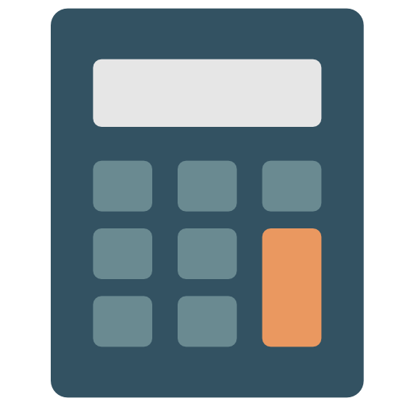
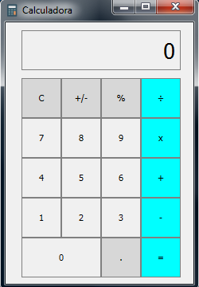

<h1 align="center">
  
    Calculadora
</h1>

<h3 align="center">
Minha primeira calculadora feita com <a href="https://www.python.org">Python</a>.
<h3>
 

<h3 align="center">
  
</h3>

 

<h2>
    💻 Tecnologias
</h2>

Tecnologias usadas para resolver o problema:

<ul>
  <li><a href="https://www.python.org">Python</a></li>
  <li><a href="https://build-system.fman.io/qt-designer-download">Qt Designer</a></li>
</ul>

 

<h2>
    📎 Algumas Funcionalidades
</h2>
Usando <code>def keyPressEvent(self, e)</code> consegui usar teclado na Calculadora.

  

<h2>
    🤔 Como Executar 
</h2>

<h4>Clonando o projeto</h4>
<pre>
git clone https://github.com/Vitor-Carmo/Calculadora-PyQt5.git
</pre>
<h4>
E execute o arquivo <code><a href="main.py">main.py</a></code>
</h4>

   

<i>
Tem alguns bugs que pretendo resolver. Caso você queira indentificar e resolver ou até mesmo me ajudar, fique avontade, use
e abuse desses códigos.
</i>

 
